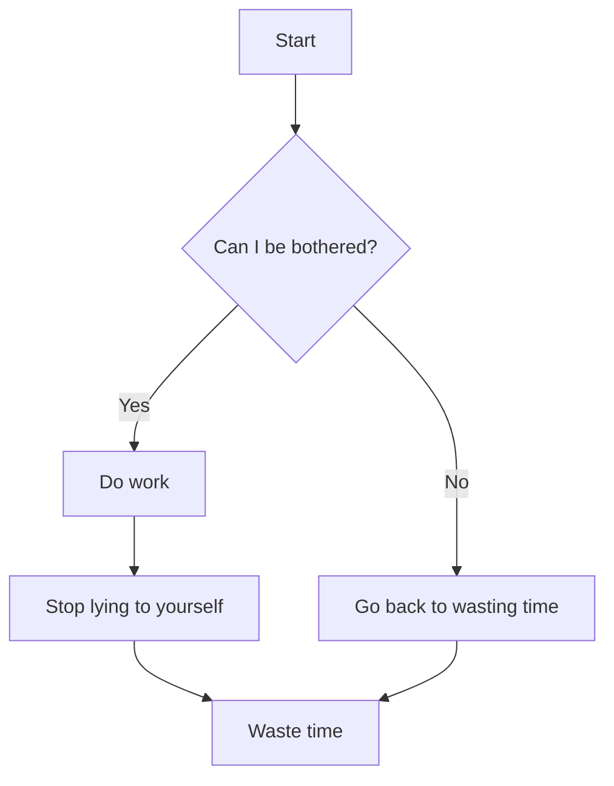

```mermaid
flowchart TD
	A[Start] --> B{Can I be bothered?};
	B -- Yes --> C[Do work];
	B -- No --> D[Go back to wasting time];
	C --> E[Stop lying to yourself];
	E --> F[Waste time];
	D --> F[Waste time];
```